# 🛒 BryStore - Premium Digital Hub

BryStore adalah aplikasi web dummy berbasis mobile-first untuk layanan top-up saldo dan pembayaran tagihan digital. Dibangun menggunakan antarmuka modern (Teal Theme), aplikasi ini dirancang khusus menyerupai pengalaman e-commerce dan fintech terkini tanpa memerlukan backend, karena sepenuhnya berjalan di sisi client menggunakan Vanilla JavaScript dan Local Storage.

---

## 🚀 Cara Menjalankan Aplikasi

Karena aplikasi ini dibangun dengan HTML, CSS, dan JavaScript murni (Vanilla), Anda tidak perlu melakukan proses build atau instalasi dependency.

1. Pastikan ketiga file (`index.html`, `style.css`, dan `script.js`) berada di dalam satu folder yang sama.
2. Cukup klik ganda (buka) file `index.html` menggunakan browser modern pilihan Anda (Chrome, Firefox, Safari, Edge).
3. Alternatif (Rekomendasi): Buka folder project menggunakan Code Editor seperti VS Code, lalu gunakan ekstensi Live Server agar pengalaman pengembangan lebih optimal.

---

## 🧪 Data Dummy untuk Uji Coba

Gunakan data berikut untuk menguji berbagai fitur pencarian dan pembayaran di dalam aplikasi:

Data Akun Login
- Username: admin
- PIN: 123456

Tagihan Listrik PLN (Pilih menu Listrik PLN lalu masukkan nomor berikut)
- 123456789012 (Atas Nama: Budi Santoso)
- 112233445566 (Atas Nama: Ani Marlina)
- 998877665544 (Atas Nama: Toko Makmur)

Tagihan Air PDAM (Pilih menu Air PDAM lalu masukkan nomor berikut)
- 987654321012 (Atas Nama: Andi Saputra)
- 223344556677 (Atas Nama: Rini Wati)

Tagihan Internet (Pilih menu Internet lalu masukkan nomor berikut)
- 192837465012 (IndiHome 30Mbps)
- 123123123123 (Biznet Home)

Tiket Seminar (Pilih menu Seminar lalu masukkan kode berikut)
- SEM-WEB-001 (Webinar Web Dev)
- SEM-AI-002 (AI Conference)

Biaya SPP (Pilih menu Biaya SPP lalu masukkan NIM berikut)
- 221011450504 (Bryan Pratama - Teknik Informatika)
- 221011450505 (Bunga Citra - Sistem Informasi)

Nomor Handphone (Untuk menguji fitur otomatis deteksi provider di menu Pulsa & Data)
- 081234567890 (Otomatis deteksi Telkomsel)
- 085712345678 (Otomatis deteksi Indosat)
- 087812345678 (Otomatis deteksi XL Axiata)
- 089612345678 (Otomatis deteksi Tri)

---

## ✨ Daftar Fitur yang Diimplementasikan

Aplikasi ini dilengkapi dengan berbagai fitur simulasi yang berfungsi secara interaktif:

- Sistem Autentikasi Dummy: Halaman login dengan validasi sederhana.
- Manajemen Saldo (State Management): Saldo tersimpan otomatis di browser menggunakan localStorage.
- Top Up Saldo: Simulasi pengisian saldo via Virtual Account, QRIS (dengan countdown timer interaktif dan generate QR Code), dan Teller/Minimarket.
- Pembayaran Tagihan (Billing): Pengecekan dan pembayaran tagihan simulasi untuk Listrik PLN, Air PDAM, Internet, dan Tiket Seminar.
- Layanan Mahasiswa (SPP): Pencarian data mahasiswa berdasarkan NIM, menampilkan daftar cicilan, dan mencentang tagihan untuk dibayar.
- Isi Pulsa & Data: Deteksi otomatis provider berdasarkan input nomor HP dan pemotongan saldo.
- Riwayat Transaksi: Pencatatan otomatis setiap transaksi berhasil yang dilengkapi dengan fitur filter kategori dan tombol pembersihan riwayat.
- Dark Mode (Mode Gelap): Penggantian tema yang preferensinya disimpan di dalam perangkat pengguna.
- Cetak Struk (Print): Struk transaksi digital yang otomatis dioptimalkan ukurannya saat fungsi Cetak/Simpan PDF digunakan.
- Desain Responsif: Mobile-first UI/UX yang mulus dan nyaman digunakan di ukuran layar smartphone.

---

## 📱 Screenshot Tampilan (Mobile)

  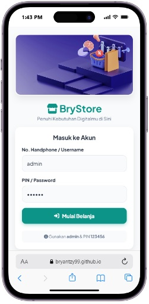
  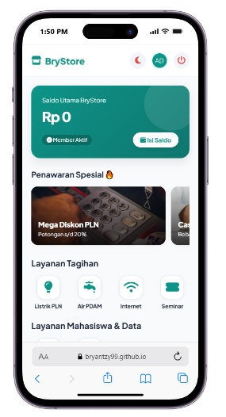
  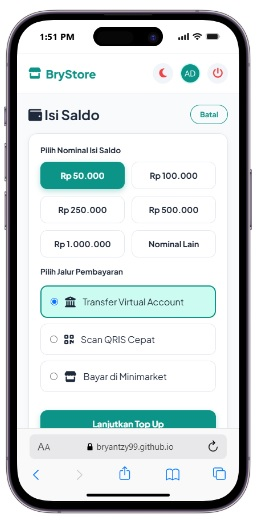
  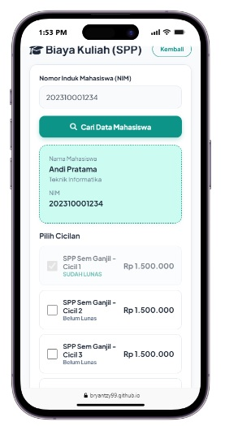
  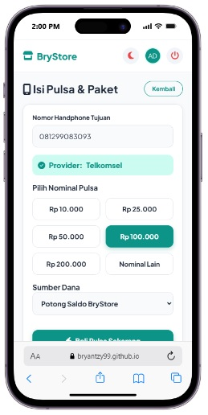
  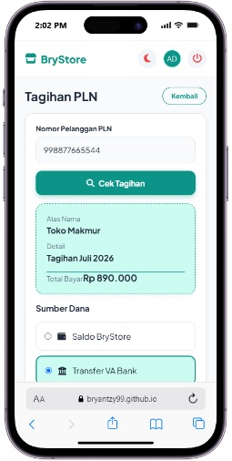
  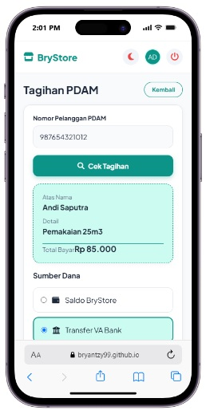
  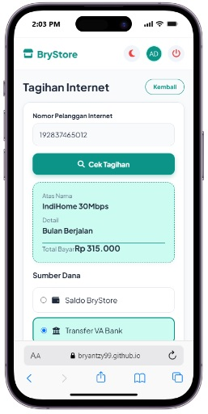
  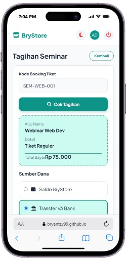
  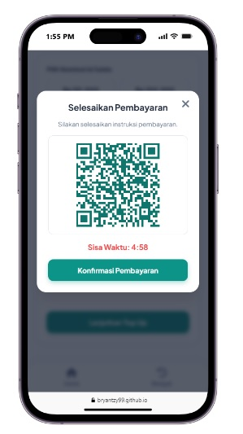
  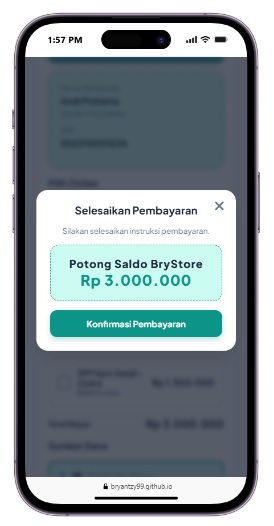
  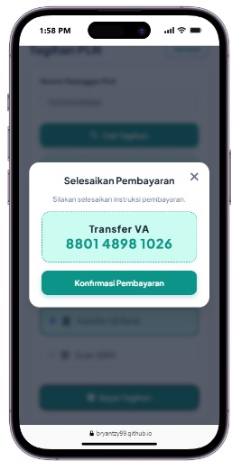
  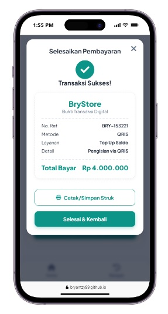
  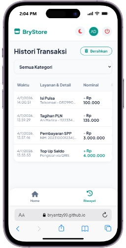

---

## 🔗 Link Demo

Anda dapat mencoba langsung aplikasi BryStore melalui tautan berikut:

👉 [Demo BryStore Live](https://bryantzy99.github.io/BryStore/)

---

Tech Stack: HTML5 | CSS3 | Vanilla JavaScript | FontAwesome | QRCode.js
